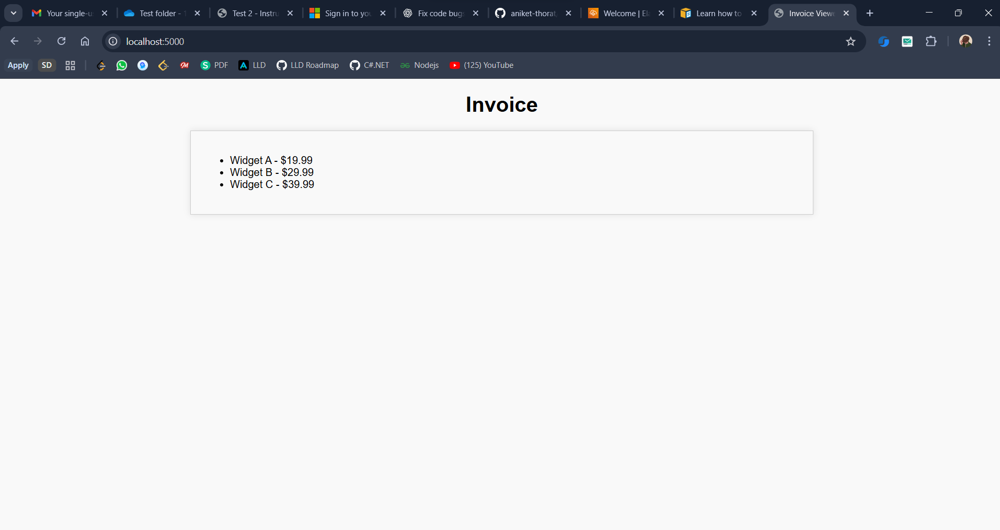
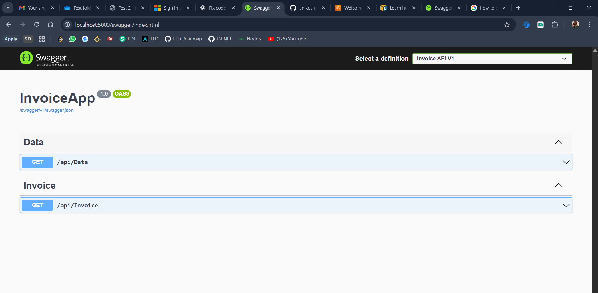
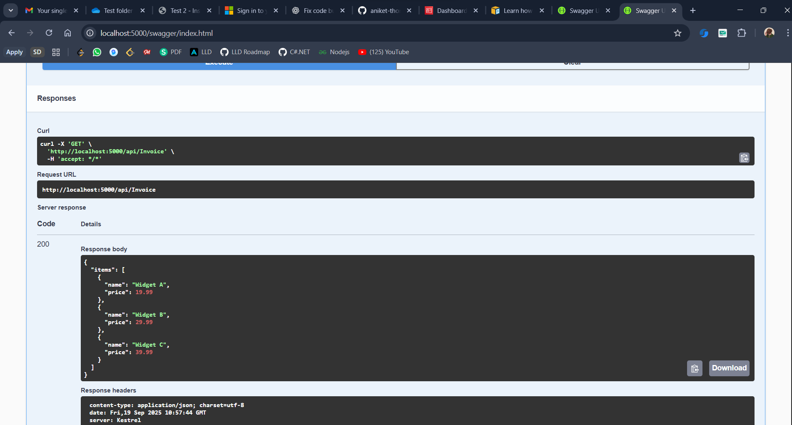

# Invoice Display Application

This is a .NET 8 Web API application that displays invoice data with a web frontend.

## 🎯 Features

- ✅ RESTful API with Swagger documentation
- ✅ SQLite database with Entity Framework Core
- ✅ Modern web frontend displaying invoice items
- ✅ CORS enabled for cross-origin requests
- ✅ Docker containerization support
- ✅ Production-ready deployment configuration

## 📱 Application Screenshots

### Main Invoice Display UI


_The main application interface showing invoice details and items_

### Swagger API Documentation


_Interactive API documentation with testable endpoints_

### Swagger API Response Screenshot


_Interactive API documentation with testable endpoints_

## Prerequisites

- .NET 8 SDK
- Visual Studio Code or Visual Studio (optional)

## 🚀 Running the Application

### Option 1: Direct .NET Run

1. **Restore dependencies:**

   ```bash
   dotnet restore
   ```

2. **Build the application:**

   ```bash
   dotnet build
   ```

3. **Run the application:**

   ```bash
   dotnet run
   ```

4. **Access the application:**
   - **Frontend (Invoice Display):** http://localhost:5000
   - **API Documentation (Swagger):** http://localhost:5000/swagger
   - **API Endpoint:** http://localhost:5000/api/invoice

## 🔌 API Endpoints

### Available Endpoints

- `GET /api/invoice` - Returns invoice data with items
- `GET /api/data` - Returns sample data

### Sample API Response

```json
{
  "items": [
    {
      "name": "Widget A",
      "price": 19.99
    },
    {
      "name": "Widget B",
      "price": 29.99
    },
    {
      "name": "Widget C",
      "price": 39.99
    }
  ]
}
```

## 🗄️ Database

The application uses SQLite database with Entity Framework Core. The database file (`invoices.db`) will be created automatically when the application runs for the first time.

### Database Schema

- **Invoices Table**: Stores invoice information (ID, Customer Name)
- **InvoiceItems Table**: Stores individual items (ID, Invoice ID, Name, Price)

## 📁 Project Structure

```
├── Controllers/          # API Controllers
│   ├── DataController.cs
│   └── InvoiceController.cs
├── Data/                # Entity Framework Context
│   └── InvoiceContext.cs
├── Models/              # Data Models
│   └── Invoice.cs
├── wwwroot/             # Static files (HTML, CSS, JS)
│   ├── index.html
│   ├── script.js
│   └── styles.css
├── Dockerfile           # Docker setup
├── Program.cs           # Application entry point
├── InvoiceApp.csproj    # Project file
└── README.md           # This file
```

## 🚀 Deployment Options

### Docker Deployment (Recommended)

```bash
# Build and run with Docker Compose
docker-compose up --build

# Or build and run manually
docker build -t invoice-app .
docker run -d -p 8080:80 --name invoice-app-container invoice-app
```

### Traditional Deployment

1. **Publish the application:**

   ```bash
   dotnet publish -c Release -o ./publish
   ```

2. **Run the published application:**
   ```bash
   cd publish
   dotnet InvoiceApp.dll
   ```

### Cloud Deployment

- **AWS Elastic Beanstalk**: Upload deployment package
- **Azure App Service**: Deploy via Visual Studio or Azure CLI
- **Google Cloud Run**: Use Docker container

## 📸 Screenshots Directory

To add screenshots to this README:

1. Create a `screenshots/` directory in your project
2. Take screenshots of:
   - Main application UI (`invoice-ui.png`)
   - Swagger API documentation (`swagger-api.png`)
   - API response in browser/Postman (`api-response.png`)
3. Place them in the `screenshots/` folder

## 📝 Notes

- ✅ The application includes sample invoice data that is seeded automatically
- ⚠️ CORS is configured to allow all origins (configure appropriately for production)
- ✅ The database is created automatically on first run
- ✅ Docker support included for easy deployment
- ✅ Production-ready configuration
